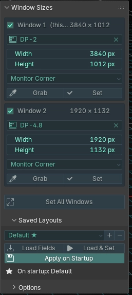

> [!Warning]
> Please note that this is not considered a professional quality add-on. It uses a 'dirty' workaround to get around some system limitations, and it has received only limited testing (see the Disclaimer below).
> It was developed for our personal use, but we're sharing it in case anyone else finds it convenient: it solves a problem that we couldn't find any other solution for, even if not in an ideal way.

[Official Site](https://candy-arts.com) | [Discord](https://discord.gg/CZ9RZxzmNf) | [Youtube](https://www.youtube.com/@CandyArtsStudio/playlists) | [Godot Asset Store](https://store.godotengine.org/publisher/candy-arts/) | [Gumroad](https://candyarts.gumroad.com/)

# Window Resizer
Window Resizer is an answer to multi-monitor users on Linux/X11 who want Blender windows to automatically span across multiple screens at startup.

## Disclaimer
The Window Manager clamps any window move or resize you request through code to the monitor(s) the window is already on. In other words, code can't just make a window span across two monitors unless it already overlaps both monitors, and it can't move a window to overlap monitor borders either.

So since the Window Manager is being precious, Window Resizer has to work around it with a trick: it takes control of the mouse to physically drag windows across monitor borders. Once a window is overlapping two monitors, the Window Manager will let it be resized across their combined bounds.

Note that this isn't exactly a clean solution: you must not touch the mouse or anything else for a few seconds while Window Resizer does its thing.

## Compatibility
### Blender
Window Resizer should work across Blender 4 and Blender 5.

It was tested on Blender 5.2 and Blender 4.5 LTS.

### System
Window Resizer works on **Linux** running an **X11** session (Xorg, or XWayland under a Wayland compositor) with an EWMH-compliant Window Manager — GNOME, KDE, XFCE, i3, and most others.

**It does not work if Blender is running as a native Wayland client.**

**It is not compatible with Windows or MacOS, or other operating systems.**

## Installation
1. Download (and extract/unzip the downloaded file)
2. Open Blender
3. Go to Preferences → Add-ons
4. Select "Install from Disk..."
5. Select 'window\_resizer\_1\_0\_0.py' and confirm.
6. Close the Preferences menu.

## Instructions
### Basics
Window Resizer adds a tab named "Windows" to the N-Panel.

In the panel, each Blender window has several data fields: Monitor, Width and Height. Simply select which monitor each window should be placed in, and specify the desired width and height.

You can also specify where the top-left corner of the window should be positioned. 3 options are provided:
- Monitor Corner (the top-left corner of the monitor)
- Monitor Offset (x;y offset from the monitor's top-left corner)
- Desktop Coordinates (absolute x;y coordinates across all monitors)

Once you have configured each window, click "Set" to resize individual windows, or "Set All Windows" to resize all the windows at once.

**Remember not to touch the mouse or anything else while windows are being resized!**

### Presets
The "Saved Layouts" section of the panel lets you save layout presets.

Click "+" to add a new preset and give it a name. Click "+" again at anytime to save changes to a preset.

To load a preset, click either "Load Fields" or "Load & Set".

To automatically load and set a preset when Blender starts, select a preset and click "Apply on Startup".

**Once Blender has launched and finished loading, it may take a few seconds before it begins to resize windows. Just wait, and don't touch the mouse or anything.**

## Risks
Any user input during the resize/reposition process may interfere and make windows fail to resize or reposition correctly.

It's not catastrophic if that happens: just click "Set" or "Set All Windows" to try again; if that fails, you can resize/reposition windows manually.
